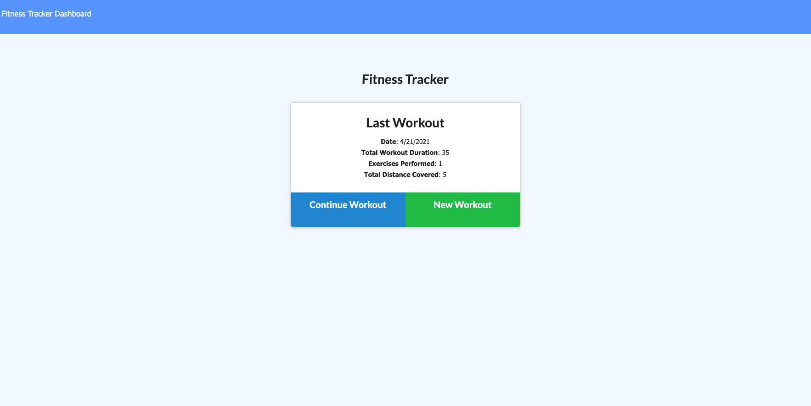

# WorkoutTracker

## Description

Workout Tracker is an application that uses MongoDB to store a user's workout. It allows the user to input the exercise, the number of sets, the number of reps, and the duration and if it is cardio, it allows the user to input the distance and duration. It will use that data to create stats for the user.

Here is a link to my deployed application: https://mysterious-fjord-13166.herokuapp.com

## Installion
You can use the Heroku link above or if you are runnning locally on your machine then you `npm i` to install the required dependencies

## Usage

If running locally use `node server` to start the server and access the localhost link by clicking the link or entering it in your browser

## Contributing
[Justin Hohing](https://github.com/jhohing)

## Questions
Contact me with any questions: [email](mailto:jnh0627@yahoo.com) , [GitHub](https://github.com/jhohing) 